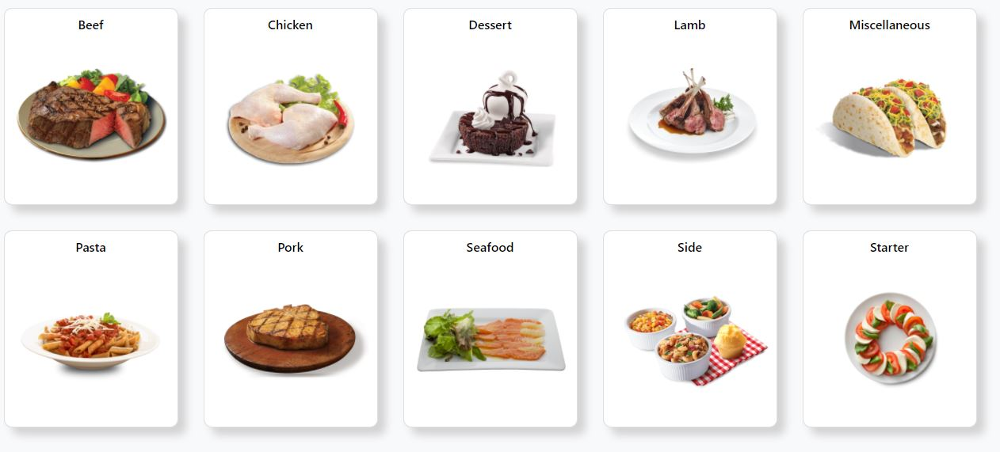
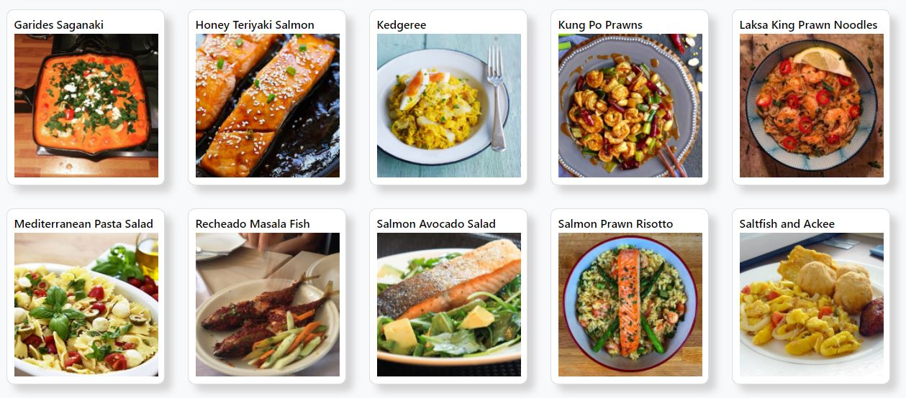
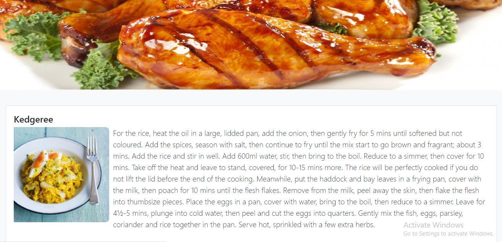

<h1>Recipe Book</h1>

The purpose of this project is to give the Recipe details for the viewers can see the recipe details from
this application and develop their cooking skills.This application will have most part of the recipes available
By using this application The person who are not known about the cooking also will learn their cooking skills. This app contains all types of recipes.

<h1>Tech Stacks are</h1>

  
    
    
  

  
  
Accessed <b>MealDB</b> for floating the Recipes in DOM.Thanks for MealDB API for giving me the very good flow of AJAX

  
  <h1></h1>
  

  
<b>Landing Page will have differnt types of main Ingriedient and their main Names so that we can easily identify which part we are doing</b>

  
  <h1></h1>
   
<b>From this page we can select different kinds of dishes</b>

  
  <h1></h1>
  
   
<b>Recipe description was available in this page </b>

  
  

